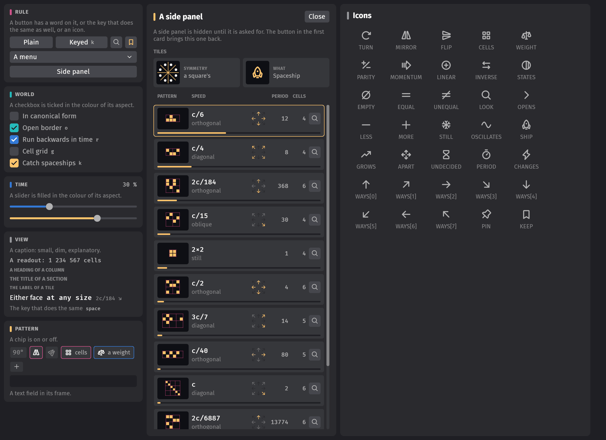

# Developing cas

```sh
cargo run --features dev            # dynamic linking: much faster incremental builds
cargo run --release -p cas-ui --example gallery   # the elements of the interface, on one page
cargo test --release --workspace
cargo clippy --release --workspace --all-targets
cargo fmt --all                     # 120 columns, short things on one line: rustfmt.toml
```

The last three run on every push (`.github/workflows/ci.yml`), with warnings as errors. The rig
scripts below need a window and a GPU, and are run by hand.

## Test rig

The app can drive itself from a tiny script (`--script`, or `--script-file`; screenshots go to
`--shots`, `shots/` unless given), which is how the UI gets exercised and screenshotted during
development. The scripts in `rig/` cover the panel, the rule menu and editor, the rule library,
the vacuum handling, the spaceship catcher, the analysis of a pattern, the keeping of patterns
and the layout in a small window; each exits with status 1 at the first expectation that fails.
A scripted run has no library file unless `--library` names one, and no folder of kept patterns:
it begins with the built-in rules, and what it keeps is gone when it ends.

```sh
cargo run --release -- --script "wait 20; shot start; click PlayPause; wait 60; shot running; quit"
for script in rig/*.cas; do cargo run --release -- --script-file $script || break; done
```

| command | effect |
|---------|--------|
| `wait N` | idle for N frames |
| `shot NAME` | save `shots/NAME.png` (see `--shots`) and wait until it is written |
| `film NAME FRAMES [N]` | FRAMES screenshots `NAME-000.png`, `NAME-001.png`, …, each followed by a step of N generations (1 unless given; negative goes backwards) |
| `click NAME [DX DY]` | pointer move / press / release on the UI node named NAME, optionally offset from its centre in logical pixels. Nodes: `PanelBody` (the cards of the control panel, which scroll in a low window), the side panels `RuleEditor`, `Catcher` and `Analysis`; `PlayPause`, `StepBack`, `StepForward`, `Reverse`, `HideVacuum`, `ShowGrid`, `ShowBlocks`, `FitView`, `Soup`, `Blob`, `Cloud`, `Clear`, the sliders `Speed`, `Stride`, `Density`, `Grid`; the rule menu `RuleMenu` and its items `RuleItem:<preset id>` (a pinned built-in rule), `RulePinned0` … (the pinned rules that were kept), `RuleRecent0` … (the latest of the others), `RuleItemLibrary`; `Library` and `EditRule`; the library panel `RuleLibrary` with `LibraryName` (the name of a built-in rule on the grid), `KeptName`, `KeptTags`, `KeptNote` (the fields of a kept one), `LibraryPin`, `LibraryKeep`, `LibraryForget`, `LibraryAbout`, `LibraryProperties` (the line that unfolds the properties asked for; `LibraryFamily` on it says what they are), `Has:<property>` (the chips, by the names `cas-search --family` takes), `SparseLess`, `SparseMore`, the tabs `CollectionTab` and `GenerateTab`, `LibraryFind` (the field, under the first), `GenerateCanonical`, `GenerateCount`, `Generate`, `Generate10`, `Generate30`, `Generate100` (under the second), `LibraryList`, `LibraryRow0` … (the rows as they are shown, from the top) and `LibraryRowPin0` … (their pins), `LibraryStatus`, `LibraryClose`; in the editor `Out0` … `Out15` (the outcomes), `RuleIdentity`, `RuleInverse`, `RuleCanonical`, `FindingSymmetry`, `FindingCellCount`, `FindingBlocks` … (what the properties say), `RuleString`, `RuleHex` and `RuleEspca` (the table in hex and Morita's number under it), `RuleCopy`, `RulePaste`, `RuleKeep`, `EditorNote` (the line that says what the last button did), `EditorClose`; the size menu `GridSize` and its items `GridSize:<side>`; `OpenBorder`, `Catching`, `Caught` (the button that opens the list of what was caught, the panel `Catcher`); in that list `CatcherCatching`, `Kind0` … (the kinds, in the order they were first caught), `AnalyseKind0` … (their magnifying glasses), `KeepKind0` … (their marks), `CatcherForget`, `CatcherKeepAll`, `CatcherNote` (the line next to it), `CatcherClose`; `Analyse` and `SelectHint` (the line next to it); in the analysis panel `AnalysisIntro` (what the panel is for, there until a pattern is), `SubjectRule` (the rule's name next to the title), `AnalysisView`, `SmallCaption` (the line under it), `AnalysisPause`, `AnalysisRestart`, `AnalysisStop` (there while a study is on its way), `SmallStatus` (the small world's generation, and what left it), `AnalysisFacts` (the tiles of what was found) and in it `StudyWhat`, `StudyPeriod`, `StudyCells`, `StudyChanges`, `StudySize`, `StudySymmetry` (a tile reads as its name, what it says, and its second line if it has one), `StudyText` (the field with the pattern's text), `AnalysisPlace`, `AnalysisCopy`, `AnalysisKeep` (there for what can be kept; it reads Keep or Kept), `AnalysisNote`, and last `StudyPieces`, `PiecesToggle` (the line of the pieces, which opens their list and folds it away), `PiecesKeep` (Keep all, on that line), `PiecesList`, `PieceClass0` … (the tiles that sum the pieces up, a class to a tile: how many, what, and the kinds), `Piece0` … (the kinds listed: spaceships, then oscillators, then still lifes) with `PieceKeep0` … (their marks), `AnalysisClose`; `Spaceships`, `Oscillators` and `StillLifes` (the buttons), their panels `KeptSpaceships`, `KeptOscillators` and `KeptStillLifes` with `KeptSpaceshipsNote`, `KeptSpaceshipsClose`, the rows `KeptSpaceship0` … (in the order of the list: the fastest ship first) and in each `KeptSpaceshipLook0` (the glass) and `KeptSpaceshipForget0` (the mark), and the same with `Oscillator` and `StillLife`; over the spaceships alone, `KeptSpaceshipsWays` (the tile with the ways they go between them) |
| `move NAME [DX DY]` | just move the pointer there |
| `drag NAME DX DY [left\|right\|middle]` | press at the node's centre, move by (DX, DY), release: drags sliders, paints, pans |
| `hold NAME FRAMES` | keep the left button down on the node for FRAMES frames |
| `scroll NAME LINES` | turn the wheel over the node |
| `key KEY` | press and release a key or chord: `Space`, `ArrowLeft`, `r`, `[`, `=`, `Ctrl+a`, ... |
| `press KEY`, `release KEY` | hold a key across other commands: `press Shift; drag Grid 60 0; release Shift`; or a mouse button (`left`, `right`, `middle`) where the pointer last was: `move Grid 0 0; press left; move Grid 60 60; shot band; release left` |
| `type TEXT` | type text into whatever has keyboard focus, a character a frame |
| `clipboard TEXT` | put text on the clipboard, as copying it elsewhere would: with `key Ctrl+v`, a long text goes into a field in one go |
| `paint X Y [on\|off]` | set a cell |
| `place RLE X Y` | put a run-length encoded pattern with its corner at (X, Y) |
| `fit` | fit the view |
| `window W H` | give the window another size, in logical pixels |
| `play`, `pause`, `step N`, `rule RULE` (preset or table), `speed N`, `stride N`, `vacuum on\|off`, `reverse on\|off`, `soup [DENSITY]`, `blob [DENSITY]`, `cloud [DENSITY]`, `clear` | direct state changes |
| `expect_gen N`, `expect_cell X Y on\|off`, `expect_population N`, `expect_rule RULE`, `expect_speed N`, `expect_stride N`, `expect_playing on\|off`, `expect_size W H`, `expect_checked NAME on\|off`, `expect_shown NAME on\|off` (a closed panel and all that is in it are not on display), `expect_text NAME TEXT` (a button reads as its caption, a row or a tile as the texts in it, a text field as what is in it; icons are not read, and space of any kind and amount counts as one space), `expect_caught SHIPS KINDS`, `expect_clipboard TEXT` | fail the run unless the state is as stated (cells and population are the pattern's, without the vacuum) |
| `until EXPECTATION` | try the expectation at every frame until it holds, as in `until expect_text Note Done.`: for what is done on another thread, or by the clock. Fails if it never does |
| `quit` | exit |

Commands are separated by `;` or newlines, `#` starts a comment. Pointer and keyboard actions are
injected as the messages `bevy_winit` would emit, so they go through picking, focus and the widgets
like real input (the window's own cursor position is left alone; winit would warp the real cursor).
Real input is discarded while a script runs and the window lets the pointer through, so a run does
not depend on what else happens at the machine. Naming a UI node that does not exist fails the
run, and so does pointing at one that is not on display.

Example: `shot a; step 500; step -500; expect_gen 0; shot b` produces two byte-identical PNGs.

Most screenshots of the scripts are the same pixels in every run of one build, so comparing
them before and after is a check on a change that is to alter nothing on screen. Not all of
them: a few show something live, and differ between two runs of the same build in just that.
These are the small world of the analysis panel with its generation, how far a study had got
when it was stopped, the caret of a text field, and the grid after playing in real time
(`catcher-3-haul`, `controls-6-flat-out`).

## The pictures of the README

The figures in `docs/` are drawn by `cargo run --release -p cas-core --example figures`, with
the code that steps the grid, so they show what the rules do. The screenshots and the animation
are taken by the test rig: `docs/tour.cas` and `docs/hero.cas` say how in their first lines (it
takes `ffmpeg`, and `oxipng` to shrink the PNGs).

## Layout

A cargo workspace of four crates. `cas-core` is the automata without the app and knows nothing
of Bevy; the app at the root and the search program are built on it. `cas-ui` is what the app's
panels are made of, and knows nothing of the automata or of the app.

| file | what |
|------|------|
| `crates/cas-core/src/rules.rs` | rules as permutation tables: presets, text form, Morita's numbers, swaps, inverse, the vacuum's cycle and the rule relative to it, analysis (population, weighted counts of cells, symmetry, time reversal), the canonical form that stands for all that only look different; tests check each preset against its definition and the numbers against the book's statements |
| `…/universe.rs` | the grid and its stepping kernel, the vacuum kept apart from the cells, resizing, what the edge does (open border, catching). Tests hold the kernel against the plain definition of a step and replay the spaceships published with Single Rotation (which pins rotation sense, bit layout and phase to the reference simulator) |
| `…/pattern.rs` | finite patterns on an unbounded plane: what becomes of a pattern left alone, its period, displacement and canonical form, taking apart patterns that only travel together, the full study of one (symmetry, heat, growth law, what it came apart into, and the period of one that is many pieces which never meet, known by them), which another thread can watch and stop, run-length encoding. Tests use the periods and displacements js-revca's tests give, hold the analysis against the grid, and replay figures of Morita's book (which pins down how his automata lie on the block grid) |
| `…/census.rs` | counting by kind the spaceships a universe caught, and by the way each was flying; a catch is identified as a whole and then by its lots of close cells, and one that does not repeat in time can be handed back for a longer look |
| `…/collection.rs` | the patterns that were kept, rule by rule: spaceships, oscillators and still lifes by the form their kind is filed under, a rule's at a time, with the cells of each to tell one that is kept already at once; the folder of text files (`patterns/<hex>.tsv`, a file to a rule) with its reading, file by file or whole, and writing |
| `…/library.rs` | the rule library: the built-in rules and the kept ones, the text file of the kept ones (`rules.tsv`) with its reading and writing, finding rules by their words and properties, and a rule kept once whatever form it comes in |
| `…/search.rs` | the trials a rule is put through, the cheap ones first, and its report |
| `…/families.rs` | the families of rules a search goes through: the rules with some properties in common (symmetries, what patterns keep, how the rule runs backwards, the form of the table), enumerated by filling in the table under those constraints and counted on several threads, their canonical rules with them (by symmetry where the empty world stays empty, and by a count made once for every rule there is, `families/every_rule.rs`), or sampled when there are too many |
| `crates/cas-core/examples/figures.rs` | draws the figures of the README |
| `crates/cas-search` | the command-line search: the table, taking up an interrupted search, a closer look at the best of a table, keeping the best in the rule library |
| `crates/cas-ui` | the kit: what the panels are made of, with only Bevy in it. The aspects with their colours and the `bevy_feathers` dark theme (`aspect.rs`), text in the faces and sizes it comes in (`text.rs`), cards, side panels with their heads, sections and tiles (`cards.rs`), buttons, checkboxes and sliders on the headless widgets, text fields, chips, tabs, and what scrolls with its scrollbar (`controls.rs`), the rows of lists and the columns, pictures and dials of the lists of patterns (`lists.rs`), and the hiding of what is turned where Bevy would not clip it (`turned.rs`). `KitPlugin` sets it up, and its own systems run last in a frame (`KitSystems`) |
| `…/src/icons.rs`, `…/assets/fonts/` | the icons: the Phosphor icon font (bold) with its licence, built into the program, and the glyphs the interface uses by name. Another icon is another constant, and a line in `ALL` for the gallery: its code point is in the `style.css` of `@phosphor-icons/web` |
| `…/examples/gallery.rs` | every element of the kit on one page, in a window of its own and with nothing of cas in it; given a path, it saves a picture of itself there |
| `src/sim.rs` | the universe in the app: transport and pacing, the settings, the system sets that order a frame; the pacing is tested in a headless app |
| `src/catcher.rs` | the spaceship list: identifies what was caught at the edge within a time budget per frame, for each rule, follows the catches that do not repeat at once for millions of generations on another thread, shows the panel, and hands a kind to the stamp when its row is clicked, or to the analysis by the row's small button |
| `src/analysis.rs` | the analysis panel: a pattern chosen with a band on the grid, sent from the list, or typed or pasted as text is studied by `cas_core::pattern::Analyser` (`Study`: fate, period, motion, symmetry, heat, growth, pieces), on Bevy's compute task pool with a `Watch` that says how far it has got and stops it, and shown living in a small universe of its own, drawn with the grid's material; a pattern that never repeats gets an open border there, and what leaves is counted by a `Census` |
| `src/actions.rs` | everything the user can ask for as one `Action` enum with a single handler; the key table, which also labels the controls; hold-to-repeat stepping; who gets the keyboard |
| `src/view.rs` | the grid node: view state (zoom / pan / fit), the UI material and its parameters (shared with the analysis panel's small view), painting and navigation via picking events, the band drawn around a pattern to analyse, and the stamp: a pattern picked up from a list or the analysis panel, shown as a ghost, turned every way its rule has it (`Analyser::turned`) and put down with a click |
| `src/grid.wgsl` | the fragment shader: view transform, cell colours, the vacuum under the cells, grid and block overlays, the band, the ghost of the stamp |
| `src/ui.rs` | the control panel as cards, one per aspect (Bevy UI, `bsn!` scenes); the rule menu, whose items are the library's pinned rules and the latest; which side panels there is room for; widget↔state sync |
| `src/editor.rs` | the rule editor panel: the sixteen cases, swap editing, the properties with their diagrams, the rule string and clipboard |
| `src/library.rs` | the rule library panel: the rule on the grid with its name, tags and note, the properties asked for (the sampler's chips) over its two tabs, the list of the rules that go by a name with its filter, the list of the rules drawn at random, the pins, the rules that were on the grid of late, and the keeping of the file (written at every change, read again when something else wrote it) |
| `src/kept.rs` | the patterns kept under the rule on the grid: a panel each for the spaceships, the oscillators and the still lifes, their rows made only for what is in sight (with room for the rest, so that the list scrolls as if they were all there), the ways the kept ships go between them, picking a pattern up, letting go of one; and the keeping of the folder: a rule's file read on another thread when the rule comes on the grid and again when something else wrote it, written at every change |
| `src/synced.rs` | a file kept in step with what the program holds of it: read again when something else wrote it, written whole at every change. The library's file |
| `src/sampler.rs` | the properties a rule is asked to have, as chips in the library panel, the count of the family (made in the background while a sample is asked for), and the sample drawn with them: so many different rules, in the order of their tables |
| `src/rig.rs`, `rig/*.cas` | the script-driven test rig and the scripts that exercise the app |
| `docs/` | the pictures of the README, and the rig scripts that take its screenshots |

Stepping backwards from generation *g* applies the inverse table with the partition the forward
step *g−1 → g* used (even generations: blocks aligned with the origin; odd: shifted by (1, 1)).

Stepping: cells are one byte each. The kernel walks the grid a pair of rows at a time, loads eight
cells of each row at once and looks two blocks up per table access; a 256×256 generation takes
about 5 µs on one core, a 4096×4096 one about 0.3 ms on six. Small grids are stepped on the calling
thread, large ones are shared out with rayon (`--threads`; the step is bound by memory, so a
handful of threads is as fast as all of them). `cargo test --release -p cas-core -- --ignored
--nocapture stopwatch` times it, and what watching the edge costs on a grid full of soup.

Drawing: the cell array is uploaded as-is into an `R8Uint` texture (one byte per cell, a plain
`memcpy` when the universe changes) and a UI material's fragment shader does everything else, so
zooming, panning and toggling overlays cost nothing on the CPU. Zoomed out, the shader looks at
every cell under a pixel (up to 8×8) and lets any live cell show, so sparse patterns stay visible.

## The kit

An element that more than one panel shows is the kit's: a function that returns a scene, and
knows nothing of the app. What it stands for and what it does are put on it by the panel that
makes it, so `ui::toggle` is the kit's `checkbox` with an action on it, and the row of a list is
the kit's `list_row` with what a click on it does. A panel says what an element shows (the
`Checked` of a checkbox or of a chip, the value of a slider) and the kit's systems, which run
after the panels', make it look that way; what lights up under the pointer is the kit's alone.



The picture is the gallery's own: `cargo run --release -p cas-ui --example gallery --
shots/gallery.png`, then shrunk as the screenshots of the README are (`docs/tour.cas` says how).

## Known gaps

The limitations users meet are in the README. Besides those:

* Catching with a closed border on a grid full of soup is slow, six times a plain step at
  256×256: everything on the edge is debris, and it is looked at again after every generation.
  Debris is told from a chain of ships by how crowded it is and how its cells lie all around,
  which is least plain in a thin soup: with a cell in ten alive, a generation costs thirty
  plain steps.
* The paused app still redraws every frame; Bevy's reactive update mode would let it idle.
* Bevy's UI neither clips nor culls a node that is turned (a `UiTransform` with a rotation): it
  draws slivers of one that lies outside what clips it. The kit therefore hides a turned node
  unless all of it is within its clip (`turned.rs`), so that the tick of a checkbox or the
  turned sign of a chip is gone a little before it has scrolled out of sight; and the arrows of
  a dial are eight glyphs, not one turned eight ways, since dials are in every scrolling list.
* Bevy's tab navigation comes with Feathers and finds nothing to go to in this interface, of
  which it warns at every press of Tab. The key has a use of its own here, so those warnings
  are filtered out of the log (`main.rs`). Going from control to control with the keyboard is
  not there: a button lets go of the focus as soon as a click is over.
* Painting and wheel zoom assume a `UiScale` of 1.
* A scripted window still takes the keyboard focus when it opens. Its input is discarded, but
  keystrokes meant for the window behind it are lost while it is in front.

## Environment notes

* Bevy 0.19.1 comes from crates.io; a checkout of that tag next to this repository (`../bevy`) is
  handy as the API reference, for its `examples/`. Bevy's features are enumerated explicitly in
  `Cargo.toml` (no 3D, audio or gamepads). `cas-core` has an optional `bevy` feature, which the
  app turns on: it only makes the universe and the random generator Bevy resources.
  Native Wayland is the crate's default `wayland` feature and needs `libwayland-dev` at build time;
  `cargo build --no-default-features` falls back to winit's X11 backend (XWayland).
* Vsync: `--vsync auto` (the default) waits for vsync only for native Wayland windows, where it
  works fine on both the NVIDIA and the Intel adapter (~60 fps; ~150 fps with `--vsync off`).
  Under XWayland `PresentMode::AutoVsync` stalls the frame loop to about 1 fps, hence the default.
