# cas

A sandbox for **reversible [block cellular automata](https://en.wikipedia.org/wiki/Block_cellular_automaton)**, written in Rust on [Bevy](https://bevy.org).
The rules act on 2×2 blocks of cells through a permutation table, so every step can be undone
and the simulation runs backwards as well as forwards. Any of the 16! such rules can be loaded;
a rule editor, a spaceship catcher and a search over families of rules come with it.

<p align="center">
  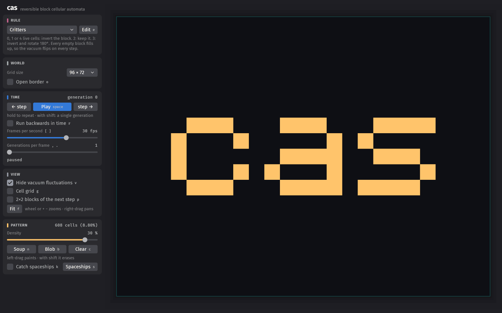
</p>

The word is written in cells and run for 72 generations under *Critters*; then time is reversed
and the same rule brings it back, cell for cell.

<table>
  <tr>
    <td width="50%" valign="top">
      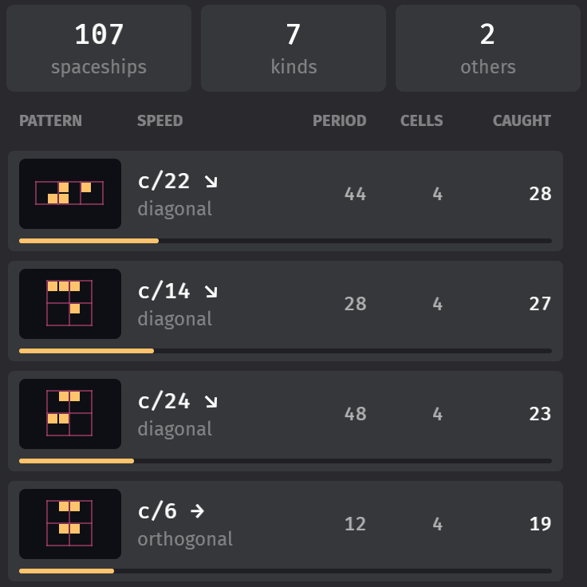
      <p><b>Spaceships are caught and classified.</b> Small patterns that reach the edge of the
      grid are taken out and run on their own until they repeat, which gives their period,
      speed and direction. Every rule keeps a list of its kinds.</p>
    </td>
    <td width="50%" valign="top">
      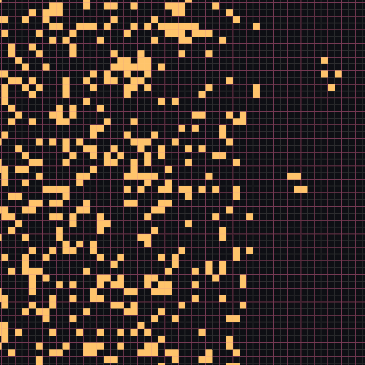
      <p><b>Cells and blocks.</b> Zoomed in, the grid shows every cell and the 2×2 blocks that
      the next step rewrites. Two spaceships have just left the blob.</p>
    </td>
  </tr>
  <tr>
    <td width="50%" valign="top">
      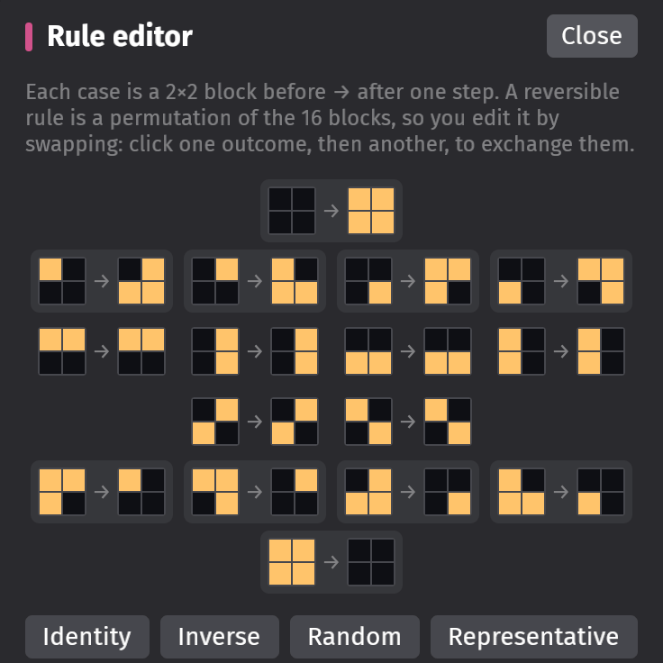
      <p><b>Rules are edited by swapping.</b> A rule is sixteen cases, and the only edit is to
      exchange two outcomes, which keeps it a permutation. Edits apply at once, also while the
      simulation runs.</p>
    </td>
    <td width="50%" valign="top">
      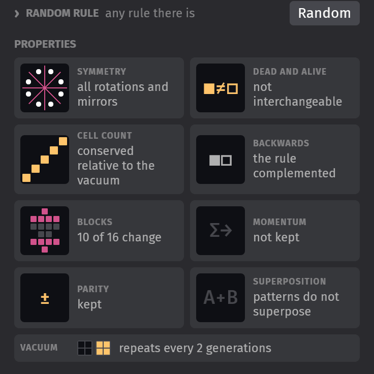
      <p><b>What follows from the table.</b> Symmetries, conserved quantities, how the rule
      relates to its own inverse, and what empty space does under it.</p>
    </td>
  </tr>
</table>

Some of the rules in the menu:

<table>
  <tr>
    <td width="25%" valign="top">
      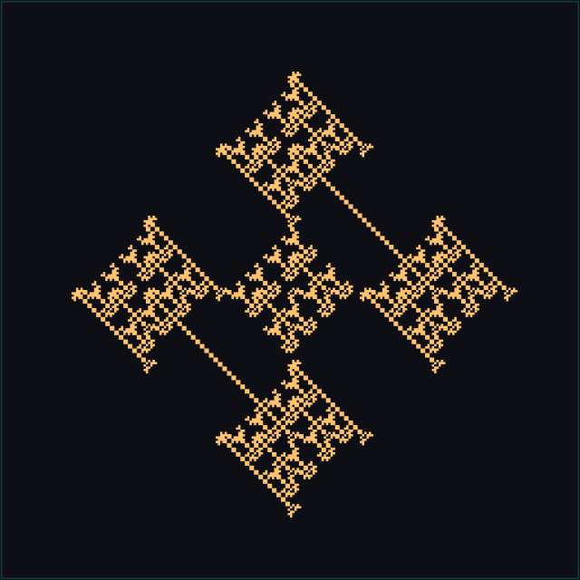
      <p><b>ESPCA-0dca8f</b>: a single cell, a hundred generations on.</p>
    </td>
    <td width="25%" valign="top">
      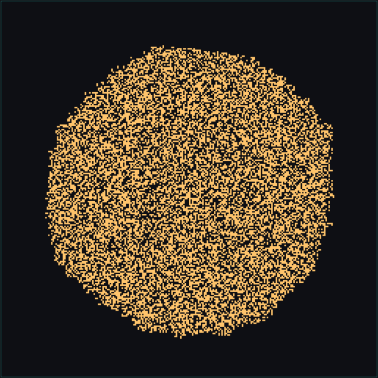
      <p><b>ESPCA-0925bf</b>: a single cell grows into a disk, and nobody knows why.</p>
    </td>
    <td width="25%" valign="top">
      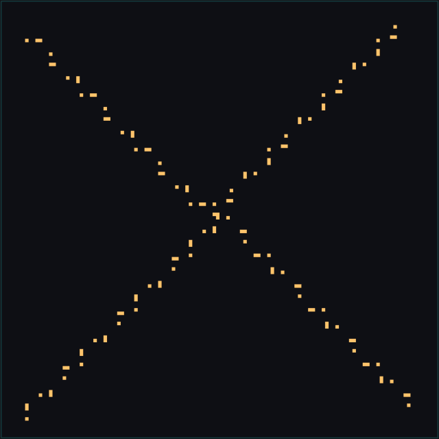
      <p><b>Four-way gun</b>: a single cell sends out spaceships for ever.</p>
    </td>
    <td width="25%" valign="top">
      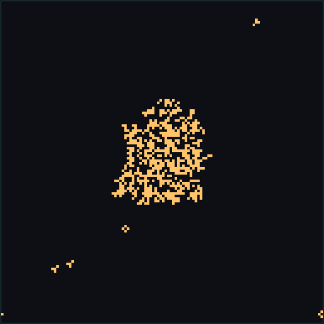
      <p><b>Ship factory</b>: a blob that makes the cells it sends away.</p>
    </td>
  </tr>
</table>

And further:

* **Any reversible rule.** 26 have names, the 1536 that look the same after a quarter turn
  have the numbers Morita gave them, and every one can be given as its table.
* **Empty space may flicker.** Under rules like Critters the empty grid changes with every
  step; the program shows, paints and counts the difference from it.
* **Fast.** Grids go up to 4096×4096 cells, and a 256×256 one runs at over a hundred thousand
  generations a second.
* **A search.** `cas-search` goes through whole families of rules without a window and picks
  out the ones in which something is going on. Seven of the rules in the menu are its finds.

## Running

It takes [Rust](https://rustup.rs) (stable). It is developed on Linux, where it also needs the
Wayland development headers (`libwayland-dev` on Debian and Ubuntu), or `--no-default-features`
to build for X11 instead. Other systems are untried.

```sh
cargo run --release                           # the app
cargo run --release -- --rule ship-factory    # starting with another rule
cargo run --release -p cas-search -- --help   # the search for rules, see below
cargo test --release --workspace
```

* `--rule RULE`: the rule to start with. A preset, by its name in the tables below in lower
  case with hyphens (`critters`, `ship-factory`); Morita's number of a rule (`espca-01c5ef`);
  or any reversible table (`0,8,4,3,2,5,9,7,1,6,10,11,12,13,14,15`).
* `--width W`, `--height H`: the size of the grid, even numbers; 256 unless given.
* `--init KIND`: what the grid starts with. `blob`, a random square in the middle; `cloud`,
  random cells thinning out from the middle; `soup`, random cells all over; or `empty`.
  `--density D` and `--seed N` say how dense (in the middle, for a cloud) and which.
* `--threads N`: threads for stepping large grids.
* `--window WxH` and `--vsync auto|on|off`: the window. `auto` waits for vsync only in native
  Wayland windows; under XWayland that would stall the app.

## Reversible block cellular automata

In Conway's Game of Life a cell's next state depends on its eight neighbours, and many patterns
lead to the same successor: the past cannot be recovered. A *block* cellular automaton works
differently. The grid is cut into 2×2 blocks and each block is replaced as a whole by a table
lookup; nothing outside the block has a say. Between steps the cut shifts by one cell
diagonally (the [Margolus neighbourhood](https://en.wikipedia.org/wiki/Block_cellular_automaton)),
so a cell shares a block with different neighbours on even and odd steps, and that is how
information gets around.

<p align="center">
  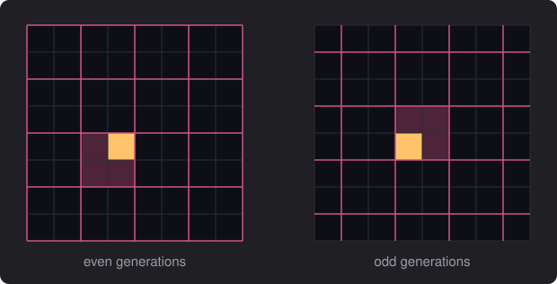
</p>

A block has 16 states, so a rule is a table of 16 entries. *Single rotation* turns every block
with exactly one live cell a quarter turn clockwise and leaves the others alone:

<p align="center">
  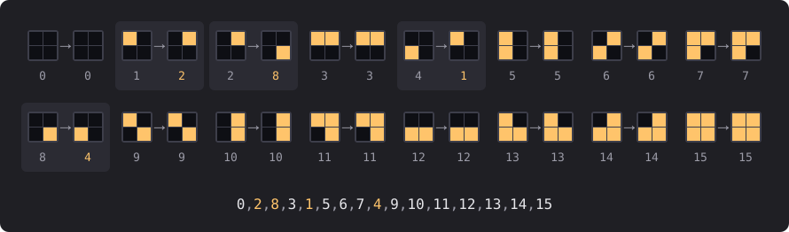
</p>

Cells count 1, 2, 4, 8 (top-left, top-right, bottom-left, bottom-right), so a block is a number
from 0 to 15 and a rule is written as its 16 outcomes, block 0 first: the line under the figure.

If the table is a permutation, every step can be undone by applying the inverse table to the
previous partition. The automaton is [reversible](https://en.wikipedia.org/wiki/Reversible_cellular_automaton):
nothing is ever lost, and however far a pattern has decayed, running backwards restores it
exactly. This is the setting of Toffoli and Margolus's *Cellular Automata Machines* (1987) and of
Morita's [*Reversible World of Cellular Automata*](https://www.worldscientific.com/worldscibooks/10.1142/13516)
(2024), where several of the rules in the menu come from. There are 16! ≈ 2·10¹³ reversible
rules, and the program runs any of them.

Under Single rotation a lone cell turns clockwise inside its block, but it is in a different
block at each step, so after four steps it is back where it started, having gone round
counterclockwise:

<p align="center">
  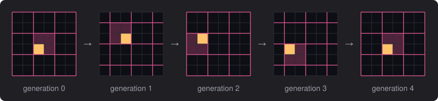
</p>

Four cells can travel instead. This spaceship returns to its shape every 12 generations, two
cells to the right: speed c/6, where c, one cell per generation, is the speed limit of these
automata.

<p align="center">
  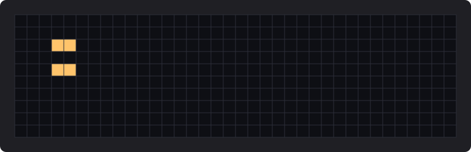
</p>

Nothing requires an empty block to stay empty. Under Critters the empty grid alternates between
all dead and all alive; under other rules it cycles through a texture with a period of up to 16.
The program derives this *vacuum* from the table and shows, paints and counts the difference
from it. A Critters glider as it is, and as that difference:

<p align="center">
  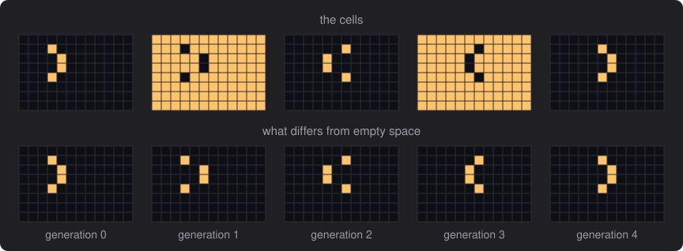
</p>

Most of the 16! rules turn any pattern into noise. The interesting ones conserve something, such
as the number of live cells (Single rotation and Critters do), or have a symmetry.
[Searching for rules](#searching-for-rules) goes through such families; the last group of rules
in the menu came out of it.

## The rules

A rule is written as its table, `0,2,8,3,1,5,6,7,4,9,10,11,12,13,14,15` being Single rotation.
That is the notation of [dmishin's simulator](https://dmishin.github.io/js-revca) and of MCell
(with an `MS,D` prefix and `;` separators), so rules can be exchanged with them. The rule menu
has three groups. From the collections of those two programs:

| preset | what it does |
|--------|--------------|
| **Single rotation** | blocks with exactly one live cell rotate 90° clockwise ([dmishin](https://dmishin.blogspot.com/2013/11/the-single-rotation-rule-remarkably.html)) |
| **Critters** | 0, 1 or 4 live cells: invert the block; 2: keep it; 3: invert and rotate 180° ([Wikipedia](https://en.wikipedia.org/wiki/Critters_(cellular_automaton))) |
| **Billiard ball machine** | a lone cell crosses its block diagonally, a diagonal pair bounces to the other diagonal |
| **Bounce gas** | the billiard ball machine, with three-cell blocks turned by 180° as well |
| **HPP gas** | every block turns by 180°, except diagonal pairs, which scatter onto the other diagonal |
| **Tron** | empty and full blocks swap, nothing else changes |
| **Rotations** | one- and three-cell blocks rotate clockwise, two-cell blocks are complemented |
| **Double rotation** | one-cell blocks rotate clockwise, three-cell blocks counter-clockwise |
| **String thing** | only two-cell blocks change: they are complemented |
| **Swap on diagonal** | every block turns by 180° |

Rules from Morita's book *Reversible World of Cellular Automata* (2024), which calls them by
number (see below):

| preset | what it does |
|--------|--------------|
| **ESPCA-01c5ef** | one-cell blocks rotate counter-clockwise, three-cell blocks clockwise, diagonal pairs jump to the other diagonal. One of the four rules the book builds reversible Turing machines in; the signal is a spaceship of period 12 |
| **ESPCA-01caef** | the mirror image of Double rotation, and another of the four. Rich in spaceships |
| **ESPCA-02c5bf** | the billiard ball machine with three-cell blocks rotated counter-clockwise: the third; the billiard ball machine itself is the fourth, ESPCA-02c5df. Can simulate every reversible rule of the family |
| **ESPCA-016a7f** | one-cell blocks rotate counter-clockwise, adjacent pairs clockwise, three-cell blocks by 180°. Has a spaceship of period 3 |
| **ESPCA-0945df** | a lone cell gains a neighbour and two side by side lose it again: cells are not conserved. Oscillators of period 6, 22 and 60, a spaceship of period 3, and a gun: two full blocks side by side |
| **ESPCA-09457f** | the same with three-cell blocks turned by 180°. A single cell is a gun that sends out four spaceships every 8 steps, forwards and backwards in time |
| **ESPCA-098aef** | spaceships of period 10 and 17 |
| **ESPCA-0925bf** | a single cell grows into an almost perfect disk; nobody knows why |
| **ESPCA-0dca8f** | a single cell grows into shapes that look like fractals |

Rules that this project's own search found (see [Searching for rules](#searching-for-rules)), named after what they do:

| preset | what it does |
|--------|--------------|
| **Steady blob** | a lone cell top-right or bottom-left gains the two cells of the other diagonal and loses them again, pairs side by side turn counter-clockwise. Cells are not conserved, yet a blob settles at one and a half times its cells and lets a slow spaceship go now and then |
| **Creeping blob** | Steady blob, where two cells top-right and bottom-left fill their block up as well. A blob keeps growing, ever more slowly: twice its cells after 30 000 generations. The richest of these in spaceships and periods |
| **Ship factory** | a blob stays a blob while it sends out small spaceships by the hundred, at a third of the speed of light: it makes the cells it loses |
| **Plus ships** | empty space goes through four states; a blob with the texture of a maze throws plus-shaped spaceships along one diagonal |
| **Four-way gun** | a single cell is a gun that sends four streams of spaceships along the diagonals; a blob turns to noise. ESPCA-f6b580 |
| **Crossing fleets** | conserves cells relative to a flipping vacuum; a blob throws off spaceships in all four diagonal directions |
| **Diagonal traffic** | Single rotation with five of the six pairs going round in a cycle; spaceships fly both ways along one diagonal |

Anything else is a **custom** rule, made in the rule editor or given as a table.

### Morita's numbers

The rules that look the same after a quarter turn have a second name. Morita studies *elementary
square partitioned cellular automata* (ESPCA): square cells with four parts, each holding a
particle or not, where a cell's next state is a function of the parts of its four neighbours that
face it. Put a site on every edge between two cells, where a particle crosses: a cell takes in the
four sites around it and puts four out, which is a block being rewritten, and the cells that do so
on even steps and those in between on odd steps are the two partitions. An ESPCA is therefore two
block automata that never meet, each drawn turned by 45°: the book's north is up and to the right
here. Its speeds are the same numbers as the ones shown here, since it counts distance along the
axes of its grid, which are the diagonals of this one.

He numbers the rules with six hexadecimal digits, the outcomes of a cell with no particle coming
in, one, two at a right angle, two head-on, three and four. `ESPCA-01c5ef` (or `espca-01c5ef`) is
accepted wherever a rule is, and the rule editor shows the number of every rule that has one: all
presets from the collections do, Single Rotation is ESPCA-04cadf and Critters ESPCA-f7ca80. There
are 1536 such rules.

Three things in the book do not fit. A figure may hold particles of both automata at once (its
stable patterns do): only those of one fit on a grid here. Its irreversible ESPCAs are not
permutations. And its triangular automata (ETPCA) and the 81-state one need another lattice and
more states.

## The app

### Controls

The panel sorts the controls into five cards by what they are about, and each of these aspects
has a colour that comes back wherever it shows up: rose for the **rule** (the rule editor, the
outline of the blocks on the grid), teal for the **world** (the edge of the grid), blue for
**time**, amber for the **pattern** (the cells, the spaceship list, the edge of the grid while it
catches them). The **view** card is grey: the automaton knows nothing of how it is drawn.

Every control shows its shortcut next to its label. Shortcuts are the characters the keys type,
so they follow the keyboard layout; with Ctrl, Alt or Super held they do nothing.

| action | UI | key / mouse |
|--------|----|-------------|
| choose a rule | the rule menu | |
| open / close the rule editor | **Edit** (*Custom…* in the rule menu opens it on your last own rule) | `e` |
| play / pause | **Play** | `space` |
| step one frame back / forward (`stride` generations); hold to repeat | **← step** / **step →** | `←` / `→` (`shift`: a single generation) |
| run backwards in time | *Run backwards in time* | `r` |
| frames per second (0.5 – 240, log scale) | *Frames per second* slider (drag, click, or wheel) | `[` / `]` halve / double |
| generations per frame, i.e. "render every Nth step" (1 – 512) | *Generations per frame* slider (drag, click, or wheel) | `,` / `.` |
| hide vacuum fluctuations | *View* checkbox | `v` |
| cell grid | *Cell grid* | `g` |
| outline the current partition: the 2×2 blocks the next forward step rewrites | *2×2 blocks of the next step* | `p` |
| zoom about the pointer | | mouse wheel, `+` / `−` |
| pan | | right- or middle-drag |
| fit the grid to the window | **Fit** | `f` |
| soup / blob density (0.01 % – 90 %, log scale) | *Density* slider (drag, click, or wheel) | |
| random soup / random blob / random cloud, as dense as the slider says in the middle and thinning out / clear | **Soup** / **Blob** / **Cloud** / **Clear** | `n` / `b` / `u` / `c` |
| grid size: 32 to 4096 cells each way; the pattern stays in the middle, what no longer fits is cut off | *Grid size* menu | |
| open border: what reaches the edge of the grid leaves the world, instead of coming back on the other side | *Open border* | `o` |
| catch the spaceships that reach the edge | *Catch spaceships* | `k` |
| show / hide the list of spaceships caught | **Spaceships** | `s` |
| pick up a caught spaceship, put it down, let go of it | a row of the list; a click on the grid; `Escape` or a right click | |
| show / hide the analysis panel; it opens choosing a pattern | | `a` |
| choose a pattern to analyse: a drag around it | **Analyse** (again: stop choosing); or ◎ in a row of the spaceship list | left-drag |
| paint | | left-drag: paints the opposite of the first cell touched; with `shift` it erases |

Sliders jump to where you click and then follow the pointer; the wheel over a slider steps it to
its next value. The overlays fade out as you zoom out (they would only be noise once cells are a
few pixels wide), so leaving them on is harmless. The block outline depends only on the generation
(even: blocks aligned with the origin, odd: shifted by one cell diagonally). Stepping forward
rewrites the outlined blocks and then the outline moves on; stepping back restores the previous
pattern together with its outline.

A frame is always a whole number of strides. A frame that did not fit in its update is made up
for by the next ones. When the machine cannot keep up with the requested rate at all, frames are
dropped rather than queued, the window stays responsive, and the status line shows the rate
actually achieved.

Under a rule whose empty space flickers, what is shown, painted and counted is the difference
from the vacuum, and a rule taken up mid-run gets the pattern as drawn. Unticking *Hide vacuum
fluctuations* puts the vacuum back under the cells and shows the automaton as it literally is.

### The rule editor

**Edit** (or `e`) opens a second panel showing the rule as its sixteen cases, each a 2×2 block
before → after one step, one rotation orbit per row. The cases the rule changes are highlighted.

A reversible rule is a permutation of the sixteen blocks, and the editor keeps it one: the only edit
is to **swap two outcomes** (click one outcome, then another). Every permutation can be
reached that way, and since every intermediate table is itself a valid rule, edits take effect at
once, also while the simulation runs. As soon as the table differs from all presets the rule menu
shows *Custom*; pick a preset and *Custom…* brings your last hand-made rule back.

* **Identity**, **Inverse** (the rule that undoes the current one) and **Random** replace the table.
  **Representative** replaces it with the table that stands for every rule making the same world:
  the least among its turns and mirrors and the generations of its vacuum's cycle it could begin at,
  which is the one the search measures. A preset is not always its own: Critters' is Critters
  turned, so the menu then says *Custom* of the same world.
* **Properties** is what analysis says about the table, each finding in words with a small
  diagram:
  * *Symmetry*: the turns and mirrors of the square under which the rule looks the same. The
    diagram shows a point and its images under those, and the axes of the mirrors; a rule with
    rotations but no mirrors, like Single Rotation, shows as a pinwheel: it has a handedness.
  * *Dead and alive*: whether exchanging the two states turns every run into another run.
  * *Cell count*: whether a pattern keeps its number of cells (possibly only relative to the
    vacuum, as in Critters). The diagram shows where the blocks go by their number of cells,
    before across and after upwards: a rule that conserves cells lights the diagonal.
  * *Backwards*: how the rule run backwards relates to the rule: the same (=), its mirror image
    (◧◨), with the two states exchanged (■□), both, or none of it (≠).
  * *Vacuum*: the empty world through the generations of its cycle.

  For a custom rule the main panel says the same in a sentence.
* **Rule string**: the table as text, with Morita's number under it if the rule has one. Type
  or paste a table, a preset name or such a number and it is applied as soon as it is valid
  (otherwise the reason is shown below the field); **Copy** and **Paste** use the system
  clipboard, and `ctrl+a`, `ctrl+c`, `ctrl+v` work in the field. While the field has focus the
  single-key shortcuts are off.

### The edge of the grid, and catching spaceships

The grid is a torus: what leaves on one side comes back on the other. *Open border* (`o`) makes
its edge open space instead. After every step, whatever has reached the first row or the first
column leaves the world (on a torus those two lines are the whole edge): small patterns whole,
anything bigger by the cells that touch the edge. A blob left to itself then evaporates.

*Catch spaceships* (`k`) is a separate matter. While it is on, the small patterns that reach the
edge are taken out of the world and identified, whether the border is open or closed; a closed
border lets everything else pass. The grid is then outlined in the colour of the cells.

* Live cells within four cells of each other are one pattern, as long as there are fewer than 20
  of them; anything bigger is debris. The ships of a dense stream lie within reach of each other
  without ever meeting: then the chain is followed a few generations to see which cells go with
  the one at the edge, and that ship is taken alone.
* To identify a pattern it is run alone on an unbounded plane until it is back in its starting
  shape, which gives its period and how far it has moved by then. What moved is a spaceship; what
  did not, or never came back, is counted under *others*. Ships that fly side by side without
  ever meeting are counted one by one.
* A ship is the same entry whichever way it flew and whenever it was caught: it is filed under
  one form chosen among all phases of its period and all the orientations the rule itself is
  symmetric under, by a fixed order (travelling right, then down; smallest bounding box; cells
  in reading order).

**Spaceships** (`s`) opens the list for the current rule; every rule has a list of its own. A row
shows the pattern, its speed as a fraction of *c* (a cell per generation) with its direction, its
period, its number of cells, how often it was caught, and as a bar its share of all catches. The
picture shows the blocks the pattern lies on: how a pattern sits on the blocks is part of what it
is, and the same cells one block over are another pattern.

A click on a row picks the pattern up. It follows the pointer over the grid as a ghost, on the
blocks of the current partition, and a click puts it down there, as often as you like; `Escape`
or a right click lets go of it. Under a rule whose empty space flickers, what is put down is the
pattern as it is at that generation. Shift-click copies the pattern as run-length encoded text
instead (`b2o2$b2o`: `b` dead, `o` alive, `$` next row, written from a corner of the blocks the
next step rewrites). **Clear list** forgets what was caught under the current rule.

What left or was caught is gone: stepping backwards does not bring it back.

### Analysing a pattern

**Analyse** (or `a`, which opens the panel) and a drag around some cells of the grid studies them
on their own: the pattern is run on an unbounded plane until it is back in its starting shape, as
the catcher does with what reaches the edge, and the *Analysis* panel says what it is.

* A **still life**, an **oscillator** or a **spaceship**, with its period, how far it moves in
  one, and its speed; whether it is one of its own turns or mirrors sooner than that (a glider is
  its mirror image half way through its period); how many cells change from one generation to the
  next, and how many never do.
* Or a pattern that **grows**, along lines as a gun does or over the plane, that **flies apart**,
  or that had not repeated after as many generations as were spent on it. What it had become by
  then is taken apart into the pieces that go their own ways, and each is followed alone: so many
  spaceships of such kinds, oscillators, still lifes, one that keeps growing.
* For any pattern: how many cells and how much room it takes, its symmetry as it sits on the
  blocks, and its run-length encoded text.

The panel shows the pattern living in a small world of its own, a torus just big enough for it,
running on a clock of its own: **Pause** holds it, **Restart** takes it back to the pattern as it
set out. A pattern that never repeats would fill that world, so it has an open border instead, and
what leaves through it is caught and counted, as on the grid: a gun's output, kind by kind.
**Place** picks the pattern up to be put down on the grid again; **Copy** copies the text. ◎ in a
row of the spaceship list sends that kind over. The study is a record: it stays when the rule
changes, under the rule named next to the title, and **Place** then puts the same cells down under
the rule now set.

Choosing stays on after a study, so the next drag studies the next pattern; `Escape`, **Analyse**
again, or picking a pattern up ends it, and left-drag paints again. `a` puts the panel away, as
`e` and `s` do theirs, and brings it back choosing.

<p align="center">
  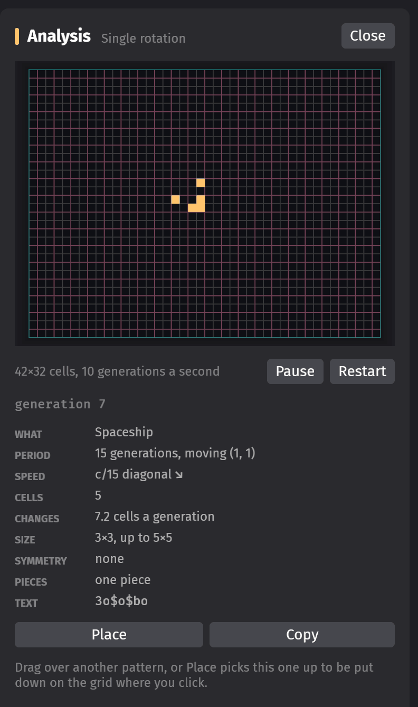
</p>

## Searching for rules

`cas-search` looks for interesting rules without opening a window: it puts every rule of a family
through a few trials, the cheap ones first, and writes one line per rule. A search from start to
finish:

```sh
# 1. Go through a family. Interrupted, the same command takes the table up where it stopped.
cargo run --release -p cas-search -- --family half-turn --out searches/half-turn.tsv
# 2. Look closer at the best of it: for longer, and with more seeds.
cargo run --release -p cas-search -- --from searches/half-turn.tsv --limit 200 \
    --seeds 1600 --generations 12000 --blob 32000 --out searches/half-turn-closer.tsv
# 3. See a find in the app, or have a rule of your own measured.
cargo run --release -- --rule 0,1,11,5,13,12,15,14,8,9,3,2,10,4,7,6
cargo run --release -p cas-search -- --rule 0,1,11,5,13,12,15,14,8,9,3,2,10,4,7,6
```

A run ends by saying how many rules of each character are in the table, and by listing the best.
The table is tab-separated under a line of column names, so `sort`, `awk` or a spreadsheet take
it from there.

The trials, and the columns they fill:

* **Seeds**: small random patterns (one to six cells) are left alone on an unbounded plane. Each
  comes back to its shape in place (`oscillating`) or elsewhere (`travelling`), flies apart
  (`scattering`), grows without bound (`growing`), or does none of it in time (`undecided`): the
  share of each in percent, with the number of different `periods` among the oscillating ones
  and the `longest`.
* **Growth**: a seed that grows spreads over the plane like a fire, or grows along lines as a gun
  does. `growth` is the power of time its cells go with, 2 or 1; of the first seeds that grow,
  the slowest, so that a rule with guns counts for its guns.
* **Spaceships**: the kinds of spaceship slower than light, among the seeds, among what a seed
  that grows along lines sends out, and among what leaves the blob.
* **Damage**: one cell of a random soup is flipped; the share in percent that differs, a hundred
  generations on, of the cells the flip could have reached.
* **Blob**: a random blob on a closed grid. `blob` is its cells in the end as a multiple of what
  it began with: about 27 if the grid has turned to noise, 1 if nothing was made or unmade.
* **Evaporation**: the same blob with the border open. `remaining` is what is left of it, again
  as a multiple; `caught` and `others` are the spaceships and the other small patterns that
  left.

Sixty seeds come first. If a tenth of them grow, no more are followed; if all that grow spread
over the plane, the rule is put through nothing more; and a blob that has spread is not left to
evaporate. Those columns stay empty. `cells` says what the rule does to the number of cells:
`conserved`, `conserved relative to the vacuum`, `conserved by weight 1112` (a cell counts for as
many as its corner of the block says, here the bottom-right one for two: cells are made and
unmade, but within bounds) or `not conserved`.

From the trials a rule gets its `character`:

| character | what the trials saw |
|-----------|---------------------|
| `explosive`, `growing` | most or some seeds grow without bound and spread over the plane |
| `linear` | seeds grow without bound, some only along lines: guns, puffers, wicks |
| `igniting` | seeds stay small, yet the blob ends with more cells than fit where it began |
| `spaceships` | something slower than light travels, and nothing gets out of hand |
| `gas` | seeds fly apart, at the speed of light |
| `frozen` | everything stays put, and so does a change |
| `confined` | everything stays put, yet a change spreads |
| `other` | none of these |

Most rules are explosive. The ones to look at have things that travel and things that stay: the
best are the `spaceships` rules with the most of both, ranked by the lesser of their kinds of
spaceship and their periods. (By kinds alone the list would be led by rules in which a lone cell
already flies and nothing stays: cells flying in formation are kinds too.) After them come the
`linear` rules that send out spaceships.

| `--family` | the rules | tables | measured | on four threads |
|------------|-----------|--------|----------|-----------------|
| `quarter-turn` | look the same after a quarter turn: Morita's ESPCAs | 1536 | 584 | seconds |
| `half-turn` | look the same after a half turn | 1 105 920 | 146 252 | 17 minutes |
| `mirror` | look the same in a mirror | 1 105 920 | 287 732 | about half an hour |
| `conserving` | keep the number of cells of every block, or trade it for the number of dead cells as Critters does | 829 440 | 78 712 | 16 minutes |
| `weighted` | keep a weighted number of cells and not their number | 107 664 | 13 746 | 5 minutes |
| `random` | `--count` random permutations, drawn with `--seed` | | | |

Rules that make the same world are measured once: those that differ only by a turn or a
mirror, by the generation of the vacuum's cycle they begin at (Critters, and Critters with dead
and alive exchanged), or by a vacuum that flickers and changes nothing else. `--limit` measures
a fair sample of a family, or with `--from` the best of a table.

How hard to look is set by `--seeds` (400), `--generations` (3000, for each seed) and `--blob`
(8000 generations). That is enough to go through a family: what character a rule has hardly
depends on it. The best deserve a closer look with four times as much, for two reasons. Kinds
and periods are counts that keep growing with the seeds, so they compare only between rules
measured alike. And a rule that does not conserve cells may look tame for 8000 generations and
spread later: of the 25 such rules of the half-turn family, 16 were still tame after 32 000
generations and 11 after 128 000.

## Limitations

* Catching takes patterns out of the world, and so does the open border: from then on stepping
  backwards does not bring them back. A mode that only watches spaceships cross the edge is not
  there yet, and neither is reseeding the grid once a blob has evaporated.
* The size menu offers square grids only; other sizes need `--width` and `--height`.
* Patterns that leave together and then part ways (a spaceship next to debris, two ships on
  different courses) are one pattern to the catcher. It never comes back to its shape, so it
  counts as one of the *others* and its ships are missed, which happens a lot in a gas like the
  billiard ball machine.
* Spaceships that follow each other closely are one pattern to the catcher as well, and a long
  train of them is debris. The gun of ESPCA-09457f fires such trains: an open border wears them
  down cell by cell, and what is left blows up. Watch it with the border closed.
* The spaceship list lives as long as the program; it is not saved.
* Buttons give up the keyboard focus so that Space and the arrows always drive the simulation,
  so there is no Tab navigation.
* Under GNOME the clipboard goes through XWayland; pasting into a native Wayland application is
  untested.

## Development

The test rig that drives the app from a script, how the pictures above are made, the layout of
the code and notes on the environment are in [DEVELOPMENT.md](DEVELOPMENT.md).

## License

Licensed under either of the [Apache License, Version 2.0](LICENSE-APACHE) or the
[MIT license](LICENSE-MIT), at your option. Unless you explicitly state otherwise, any
contribution intentionally submitted for inclusion in the work by you, as defined in the
Apache-2.0 license, shall be dual licensed as above, without any additional terms or conditions.
